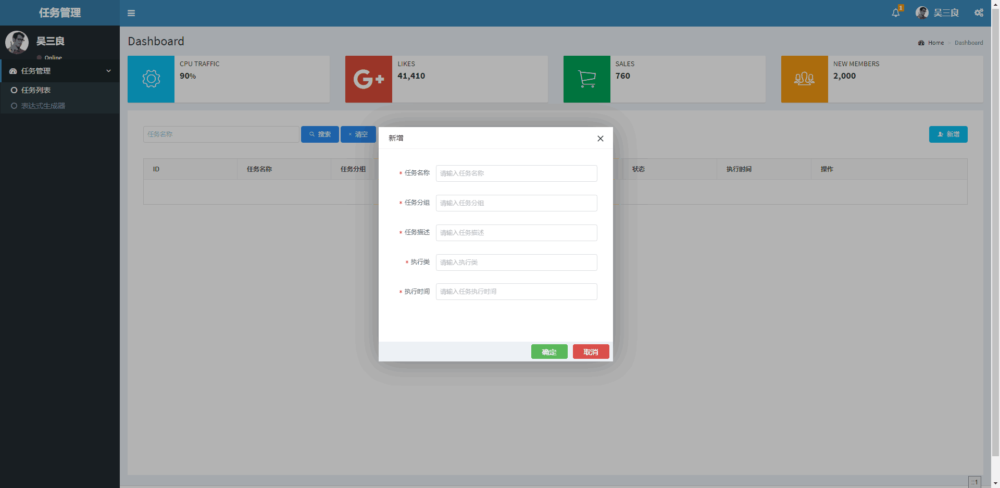
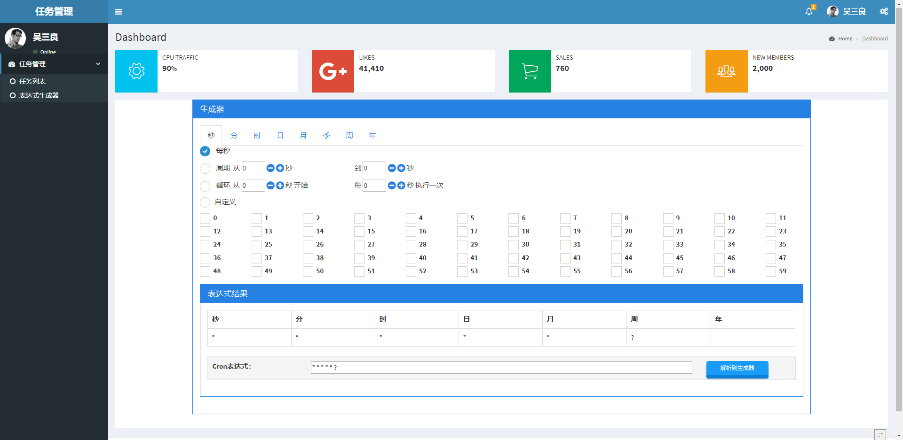

# spring-boot-quartz-plus
本项目是spring boot和quartz的集成，带操作页面，可实时添加删除任务。

Quartz定时任务默认都是并发执行的，不会等待上一次任务执行完毕，只要间隔时间到就会执行, 如果定时任执行太长，会长时间占用资源，导致其它任务堵塞。

当不使用spring的时候就需要在Job的实现类上加@DisallowConcurrentExecution的注释
@DisallowConcurrentExecution 禁止并发执行多个相同定义的JobDetail, 这个注解是加在Job类上的, 但意思并不是不能同时执行多个Job, 而是不能并发执行同一个Job Definition(由JobDetail定义), 但是可以同时执行多个不同的JobDetail, 举例说明,我们有一个Job类,叫做SayHelloJob, 并在这个Job上加了这个注解, 然后在这个Job上定义了很多个JobDetail, 如sayHelloToJoeJobDetail, sayHelloToMikeJobDetail, 那么当scheduler启动时, 不会并发执行多个sayHelloToJoeJobDetail或者sayHelloToMikeJobDetail, 但可以同时执行sayHelloToJoeJobDetail跟sayHelloToMikeJobDetail

@PersistJobDataAfterExecution 同样, 也是加在Job上,表示当正常执行完Job后, JobDataMap中的数据应该被改动, 以被下一次调用时用。当使用@PersistJobDataAfterExecution 注解时, 为了避免并发时, 存储数据造成混乱, 强烈建议把@DisallowConcurrentExecution注解也加上。

* 数据库：spring-boot-quartz 
建表sql：

* 登录页：
    http://localhost:9001/quartz/login.shtml
    假的，登录效果没有实现，用户名密码无需输入，直接点登录就会跳转主页
* 主页：
    http://localhost:9001/quartz/main.shtml
    不从登录页跳转，直接访问主页也是可以的
    
* 项目运行结果图： 

