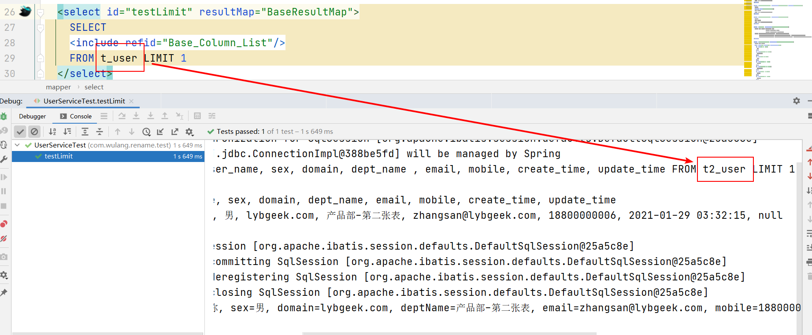
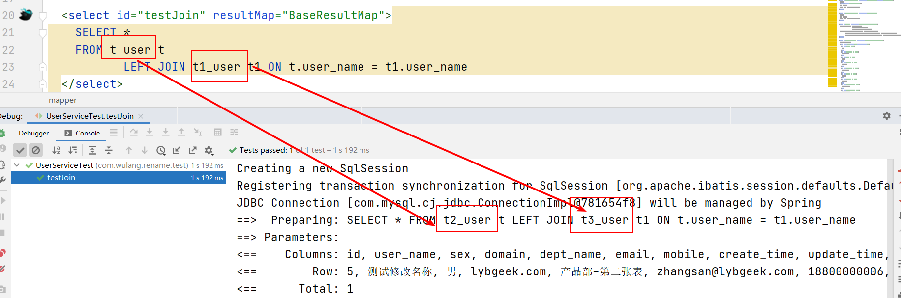
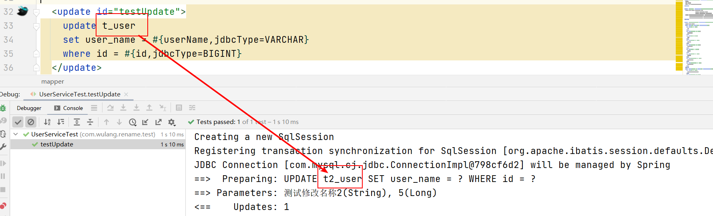

1. 需求背景
> 表名称是存在规律性变化，如 user user_2021_03 user_2021_04 等，若修改SQL则工程量比较大。
>
> eg：
>       SELECT * FROM t_user LIMIT 1 是原来SQL 需要修改为
>       SELECT * FROM <font color="#dd0000">t2_user</font> LIMIT 1

2. 实现思路
>  拦截SQL,修改表名,表明映射关系可基于内存或外部存储形成映射关系

* 1.通过注解判断是否需要处理此SQL
* 2.获取SQL语句
* 3.通过Druid解析SQL语句，获取visitor
* 4.根据visitor 判断SQL语句类型
* 5.根据语句类型改造SQL语句
* 6.应用修改后的SQL语句

3. 核心代码

```
@Intercepts({@Signature(type = Executor.class, method = "query", args = {MappedStatement.class, Object.class, RowBounds.class, ResultHandler.class}),
    @Signature(type = Executor.class, method = "update", args = {MappedStatement.class, Object.class}),})
public class RerouteToTableInterceptor implements Interceptor {
private Map map;
private Set<String> tableSet;
public static boolean openInterceptor = false;

    public RerouteToTableInterceptor() {
        //标识使用了该插件
        setOpenInterceptor(true);
    }

    @Override
    public Object intercept(Invocation invocation) throws Throwable {
        Object[] args = invocation.getArgs();
        MappedStatement ms = (MappedStatement) args[0];
        Object parameterObject = args[1];
        BoundSql boundSql = ms.getBoundSql(parameterObject);
        String sql = boundSql.getSql();
        MySqlSchemaStatVisitor visitor = getMySqlSchemaStatVisitor(sql);
        Map<TableStat.Name, TableStat> tableMap = visitor.getTables();
        for (Map.Entry<TableStat.Name, TableStat> next : tableMap.entrySet()) {
            TableStat.Name key = next.getKey();
            String tableName = key.toString();
            String vaule = TableNameFactory.getValue(tableName);
            if (!StringUtils.isEmpty(vaule)) {
                sql = sql.replace(tableName, vaule);
            }
        }
        MySqlStatementParser mySqlStatementParser = new MySqlStatementParser(sql);
        SQLStatement statement = mySqlStatementParser.parseStatement();
        BoundSql bs = new BoundSql(ms.getConfiguration(), statement.toString(), boundSql.getParameterMappings(), parameterObject);
        MappedStatement newMs = copyFromMappedStatement(ms, new BoundSqlSqlSource(bs));
        for (ParameterMapping mapping : boundSql.getParameterMappings()) {
            String prop = mapping.getProperty();
            if (boundSql.hasAdditionalParameter(prop)) {
                bs.setAdditionalParameter(prop, boundSql.getAdditionalParameter(prop));
            }
        }
        args[0] = newMs;

        return invocation.proceed();
    }

    @Override
    public Object plugin(Object target) {
        return Plugin.wrap(target, this);
    }

    @Override
    public void setProperties(Properties properties) {
    }

    public Map getMap() {
        return map;
    }

    public void setMap(Map map) {
        tableSet = map.keySet();
        this.map = map;
    }

    public boolean isOpenInterceptor() {
        return openInterceptor;
    }

    public void setOpenInterceptor(boolean openInterceptor) {
        RerouteToTableInterceptor.openInterceptor = openInterceptor;
    }

    private MappedStatement copyFromMappedStatement(MappedStatement ms, SqlSource newSqlSource) {
        MappedStatement.Builder builder = new MappedStatement.Builder(ms.getConfiguration(), ms.getId(), newSqlSource, ms.getSqlCommandType());
        builder.resource(ms.getResource());
        builder.fetchSize(ms.getFetchSize());
        builder.statementType(ms.getStatementType());
        builder.keyGenerator(ms.getKeyGenerator());
        if (ms.getKeyProperties() != null && ms.getKeyProperties().length > 0) {
            builder.keyProperty(ms.getKeyProperties()[0]);
        }
        builder.timeout(ms.getTimeout());
        builder.parameterMap(ms.getParameterMap());
        builder.resultMaps(ms.getResultMaps());
        builder.resultSetType(ms.getResultSetType());
        builder.cache(ms.getCache());
        builder.flushCacheRequired(ms.isFlushCacheRequired());
        builder.useCache(ms.isUseCache());
        return builder.build();
    }

    /**
     * 通过Druid 获取到SQL的 Visitor
     *
     * @param sqlStr sql
     * @return
     */
    private MySqlSchemaStatVisitor getMySqlSchemaStatVisitor(String sqlStr) {
        MySqlStatementParser parser = new MySqlStatementParser(sqlStr);
        SQLStatement sqlStatement = parser.parseStatementList().get(0);
        MySqlSchemaStatVisitor visitor = new MySqlSchemaStatVisitor();
        sqlStatement.accept(visitor);
        return visitor;
    }

    public static class BoundSqlSqlSource implements SqlSource {
        private BoundSql boundSql;

        public BoundSqlSqlSource(BoundSql boundSql) {
            this.boundSql = boundSql;
        }

        @Override
        public BoundSql getBoundSql(Object parameterObject) {
            return boundSql;
        }
    }
}

```

4. 实现效果

**简单查询**


**join 查询**


**update 语句**


5. 待改进点
* 可能存在部分SQL不需要修改的情况,可自定义注解,只有标记注解了的才去使用
* 拦截重写后的性能测试没有去做,所以对程序的影响未知

6. 参考文章：

[mybatis插件实现自定义改写表名](https://blog.csdn.net/hncaoyuqi/article/details/103187983)

[讲一讲Mybatis插件的原理及如何实现？](https://zhuanlan.zhihu.com/p/250558017)
