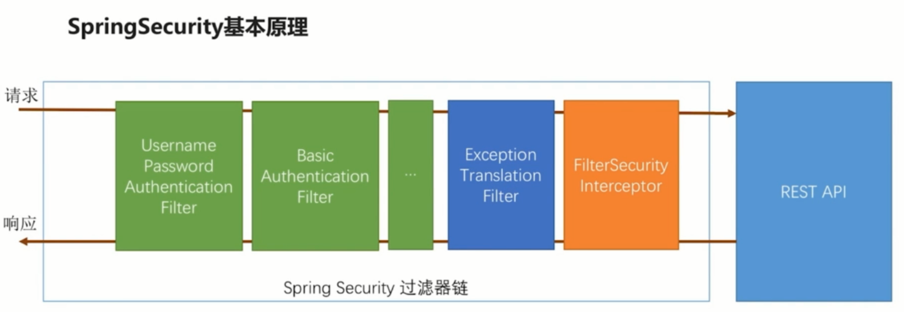

# security

**前提知识：**
* **过滤器**：可以拿到请求和响应的信息，拿不到处理方法的信息
* **拦截器**：可以拿到请求和响应，也能拿到真正处理方法的信息，拿不到方法被调用的时候那个参数的值
* **切片**：可以拿到调用方法的时候真正传进来的值，拿不到请求和响应的对象。
---


处理用户信息获取逻辑：任何实现了UserDetailsService 接口的对象都可以作为认证数据源

1. authorizeRequests（）方法实际上返回了一个URL拦截注册器，我们可以调用它提供的anyanyRequest（）、antMatchers（）和regexMatchers（）等方法来匹配系统的URL，并为其指定安全策略。
>antMatchers（）是一个采用ANT模式的URL匹配器。ANT模式使用？匹配任意单个字符，使用*匹配0或任意数量的字符，使用**匹配0或者更多的目录。antMatchers（"/admin/api/**"）相当于匹配了/admin/api/下的所有API。

2. formLogin（）方法和httpBasic（）方法都声明了需要Spring Security提供的表单认证方式，分别返回对应的配置器。其中，formLogin（）.loginPage（"/myLogin.html"）指定自定义的登录页/myLogin.html，同时，Spring Security会用/myLogin.html注册一个POST路由，用于接收登录请求。

3. csrf（）方法是Spring Security提供的跨站请求伪造防护功能，当我们继承WebSecurityConfigurer Adapter时会默认开启csrf（）方法。

>调用这些方法之后，除非使用and（）方法结束当前标签，上下文才会回到HttpSecurity，否则链式调用的上下文将自动进入对应标签域。

虽然Spring Security的过滤器链对过滤器没有特殊要求，只要继承了 Filter 即可，但是在 Spring 体系中，推荐使用OncePerRequestFilter来实现，它可以确保一次请求只会通过一次该过滤器（Filter实际上并不能保证这一点）。

只要我们使用会话管理功能，就应该同时配置HttpSessionEventPublisher。

值得一提的是，principals采用了以用户信息为key的设计。我们知道，在hashMap中，以对象为key必须覆写hashCode和equals两个方法（具体原因可以查阅hashMap的设计），但我们实现UserDetails时并没有这么做，这导致同一个用户每次登录注销时计算得到的key都不相同，所以每次登录都会向principals中添加一个用户，而注销时却从来不能有效移除。在这种情况下，不仅达不到会话并发控制的效果，还会引发内存泄露。

在任何情况下，都应当尽可能地避免以GET方式提供涉及数据修改的API。

* CORS
Spring Security对CORS提供了非常好的支持，只需在配置器中启用CORS支持，并编写一个CORS配置源即可。
核心实现并不复杂，DefaultCorsProcessor中的handleInternal方法是处理CORS的核心，流程非常清晰。

* CSRF
当使用POST请求时，确实避免了如img、script、iframe等标签自动发起GET请求的问题，但这并不能杜绝CSRF攻击的发生。
在任何情况下，都应当尽可能地避免以GET方式提供涉及数据修改的API。

在此基础上，防御CSRF攻击的方式主要有以下两种。
1.HTTP Referer
当然，这种方式简单便捷，但并非完全可靠。除前面提到的部分浏览器可以篡改 HTTP Referer外，如果用户在浏览器中设置了不被跟踪，那么HTTP Referer字段就不会自动添加，当合法用户访问时，系统会认为是CSRF攻击，从而拒绝访问。

2.CsrfToken认证

授权的方式包括 web授权和方法授权，web授权是通过 url拦截进行授权，方法授权是通过 方法拦截进行授权。
他们都会调用accessDecisionManager进行授权决策，
若为web授权则拦截器为FilterSecurityInterceptor；
若为方法授权则拦截器为MethodSecurityInterceptor。
如果同时通过web授权和方法授权则先执行web授权，再执行方法授权，最后决策通过，则允许访问资源，否则将禁止访问。

核心配置类部分代码示例： [WebSecurityConfig.Java](https://github.com/sanliangitch/spring-boot-demo/blob/master-wulang/spring-boot-security-core/src/main/java/com/wulang/security/common/security/WebSecurityConfig.java)
```
  @Override
      protected void configure(HttpSecurity http) throws Exception {
       http     // 定义哪些url 是否需要保护
                      .authorizeRequests()
                      //对preflight（"预检"请求）放行
                      .requestMatchers(CorsUtils::isPreFlightRequest).permitAll()
                      //基于spring security实现动态权限的方法
                      .withObjectPostProcessor(new ObjectPostProcessor<FilterSecurityInterceptor>() {
                          @Override
                          public <O extends FilterSecurityInterceptor> O postProcess(O o) {
                              //重写SecurityMetadataSource用来动态获取url权限配置
                              o.setSecurityMetadataSource(metadataSource);
                              //AccessDecisionManager来进行权限判断
                              o.setAccessDecisionManager(urlAccessDecisionManager);
                              return o;
                          }
                      })
                      .and()
                      //允许表单登录
                          .formLogin()
                              //指定我们自己的登录页,spring security以重定向方式跳转到/login_p
                              .loginPage("/login_p")
                              //自定义表单提交登录的url默认 /login
                              .loginProcessingUrl("/security/login")
                              //自定义登录参数名 默认为 username
                              .usernameParameter("username")
                              //自定义登录参数名 默认为 password
                              .passwordParameter("password")
                              //登录失败处理
                              .failureHandler(customAuthenticationFailureHandler)
                              //登录成功处理器
                              .successHandler(customAuthenticationSuccessHandler)
                              .permitAll()
                      .and()
                          .logout()
                              //设置触发退出操作的URL (默认是/logout ).
                              .logoutUrl("/security/logout")
                              //添加一个LogoutHandler ，用于实现用户退出时的清理工作.默认SecurityContextLogoutHandler 会被添加为最后一个LogoutHandler 。
                              .logoutSuccessHandler(customAuthenticationLogoutHandler)
                              //指定是否在退出时让HttpSession 无效。 默认设置为 true。
                              .invalidateHttpSession(true)
                              .permitAll()
                      .and()
                          // 关闭 CSRF
                          .csrf().disable()
                          //添加未授权处理   未登录或者登陆过期、未授权 的拦截回调
      //                    .exceptionHandling().authenticationEntryPoint()
                          //权限不足处理
                          .exceptionHandling().accessDeniedHandler(deniedHandler);
      }
```
