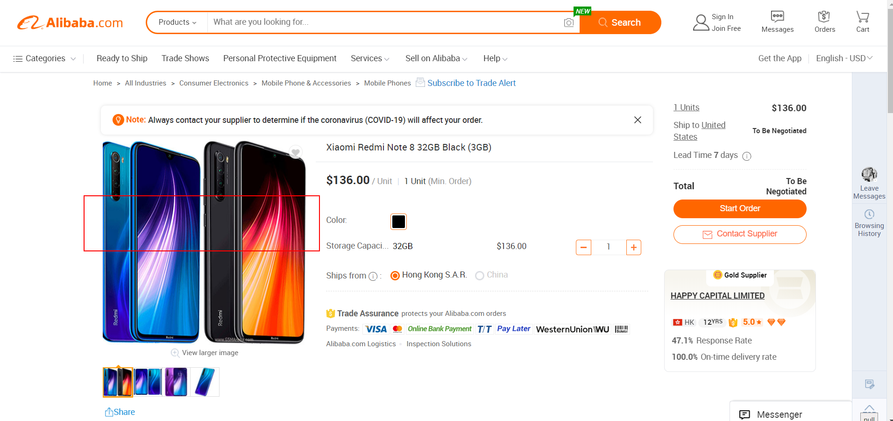
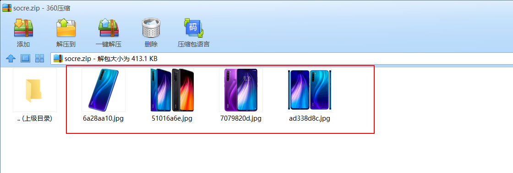
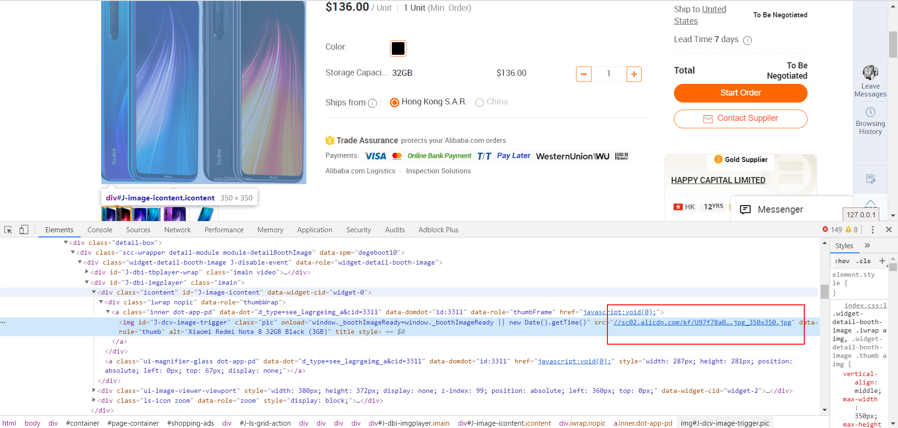
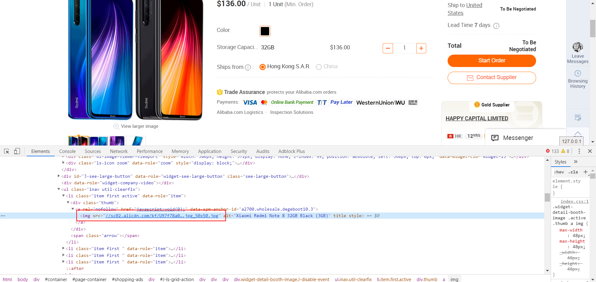

# 项目介绍

## 1. 需求分析
根据项目需求，需要爬取阿里巴巴国际站的详情图片，并返回zip压缩包


## 2. 实现效果图


## 3. 问题分析
### 问题1
如何解析出一个URL的HTML页面，并提取出里面需要下载的地址？

<u>通过jsoup工具包，提取分析出我们所需要的url地址</u>

### 问题2
一个页面的url地址很多，怎样才能取出我们想要的？


<u>通过观察页面得知，大图就是小图后面取消50x50的url地址</u>

### 问题3
url地址获取后，怎样返回一个zip压缩包？

<u>目前实现思路是，先下载全部图片到一个文件夹，之后压缩成zip，返回zip文件即可</u>
<u>**优化空间：想到的优化空间为实现零拷贝**</u>

# 4. 技术选型
- SpringBoot
- jsoup

# 5. 重要代码
### SpiderPictureService.java

```java
public class SpiderPictureService {

    private static final Logger LOG = LoggerFactory.getLogger(SpiderPictureService.class);

    static String filePathWindows = "E:\\spirt";
    static String filePathLinux = "/tmp";
    /**
     * true 表示Windows环境
     * false 表示Linux环境
     */
    static volatile boolean FLAG = true;
    public static final Integer MAX_VISIT_COUNT = 5;
    private static Semaphore semaphore = new Semaphore(MAX_VISIT_COUNT);

    /**
     * 在此做爬虫的限流处理
     *
     * @param spiderPictureURL
     * @param response
     * @return
     */
    public Result downloadSpiderPictureSemaphore(String spiderPictureURL, HttpServletResponse response) {
        try {
            Result result;
            boolean success = semaphore.tryAcquire(10, TimeUnit.SECONDS);
            if (success) {
                result = downloadSpiderPicture(spiderPictureURL, response);
                return result;
            }
            return new Result(1, "请稍后重试");
        } catch (InterruptedException e) {
            e.printStackTrace();
        } finally {
            semaphore.release();
        }
        return new Result(1, "请稍后重试");
    }

    /**
     * 根据URL下载图片
     * 1.根据网址爬取出图片的url
     * 2.将url下载到本地
     * 3.所有下载下来的图片压缩成zip返回
     * 4.删除本地文件
     *
     * @param spiderPictureURL
     * @return
     */
    public Result downloadSpiderPicture(String spiderPictureURL, HttpServletResponse response) {
        String uuid = UUID.randomUUID().toString().substring(0, 10);
        String system = System.getProperty("os.name");
        //下载图片
        if (system.toLowerCase().startsWith("win")) {
            FLAG = true;
            //windows10
            downloadImg(spiderPictureURL, filePathWindows, uuid);
        } else {
            FLAG = false;
            //Linux
            downloadImg(spiderPictureURL, filePathLinux, uuid);
        }
        //压缩成ZIP
        List<File> fileList = new ArrayList<>();
        File file;
        if (FLAG) {
            file = new File(filePathWindows + "\\" + uuid + "\\");
        } else {
            file = new File(filePathLinux + "/" + uuid + "/");
        }
        File[] listFiles = file.listFiles();
        String path = file.getPath();
        for (int i = 0; i < listFiles.length; i++) {
            //排除是隐藏文件
            if (listFiles[i].isFile() && !listFiles[i].isHidden()) {
                File temp;
                if (FLAG) {
                    temp = new File(path + "\\" + listFiles[i].getName());
                } else {
                    temp = new File(path + "/" + listFiles[i].getName());
                }
                //循环把文件名放到list里面
                fileList.add(temp);
            }
        }
        try {
            String zipPathName;
            if (FLAG) {
                zipPathName = path + "\\" + "socre" + ".zip";
            } else {
                zipPathName = path + "/" + "socre" + ".zip";
            }
            File zipPath = new File(zipPathName);
            FileOutputStream fileOutputStream = new FileOutputStream(zipPath);
            ZipUtil.toZip(fileList, fileOutputStream);
            //导出
            try {
                download(zipPathName, response);
            } catch (UnsupportedEncodingException e) {
                e.printStackTrace();
                LOG.error("下载zip出错，下载路径为：{}，请求地址为：{}", zipPathName + uuid, spiderPictureURL);
                return new Result(1, "下载zip出错，请稍后重试");
            }
        } catch (FileNotFoundException e) {
            e.printStackTrace();
            LOG.error("压缩文件出错，压缩路径为：{}，请求地址为：{}", path + uuid, spiderPictureURL);
            return new Result(1, "压缩文件出错，请稍后重试");
        } finally {
            deleteFile(new File(path));
        }

        return new Result(0, "爬取成功", response);
    }

    public static void deleteFile(File file) {
        //判断文件不为null或文件目录存在
        if (file == null || !file.exists()) {
            System.out.println("文件删除失败,请检查文件路径是否正确");
            return;
        }
        //取得这个目录下的所有子文件对象
        File[] files = file.listFiles();
        //遍历该目录下的文件对象
        for (File f : files) {
            //打印文件名
            String name = file.getName();
            System.out.println(name);
            //判断子目录是否存在子目录,如果是文件则删除
            if (f.isDirectory()) {
                deleteFile(f);
            } else {
                f.delete();
            }
        }
        //删除空文件夹  for循环已经把上一层节点的目录清空。
        file.delete();
    }

    //下载zip
    public String download(String zipUrl, HttpServletResponse response) throws UnsupportedEncodingException {
        if (zipUrl != null) {
            File file = new File(zipUrl);
            // 如果文件名存在，则进行下载
            if (file.exists()) {
                /*设置response 的 header*/
                // 配置文件下载
                response.setHeader("content-type", "application/zip");
                response.setContentType("application/zip");
                // 下载文件能正常显示中文
                if (FLAG) {
                    //windows
                    response.setHeader("Content-Disposition", "attachment;filename=" + URLEncoder.encode(zipUrl.substring(zipUrl.lastIndexOf("\\") + 1), "UTF-8"));
                } else {
                    response.setHeader("Content-Disposition", "attachment;filename=" + URLEncoder.encode(zipUrl.substring(zipUrl.lastIndexOf("/") + 1), "UTF-8"));
                }
                byte[] buffer = new byte[1024];
                FileInputStream fis = null;
                BufferedInputStream bis = null;
                try {
                    fis = new FileInputStream(file);
                    bis = new BufferedInputStream(fis);
                    OutputStream os = response.getOutputStream();
                    int i = bis.read(buffer);
                    while (i != -1) {
                        os.write(buffer, 0, i);
                        i = bis.read(buffer);
                    }
                    System.out.println("Download the song successfully!");
                } catch (Exception e) {
                    System.out.println("Download the song failed!");
                } finally {
                    if (bis != null) {
                        try {
                            bis.close();
                        } catch (IOException e) {
                            e.printStackTrace();
                        }
                    }
                    if (fis != null) {
                        try {
                            fis.close();
                        } catch (IOException e) {
                            e.printStackTrace();
                        }
                    }
                }
            }
        }
        return null;
    }

    /**
     * @param spiderPictureURL
     * @param filePath         存放的路径
     * @param uuid             随机拼接的字符串
     */
    private void downloadImg(String spiderPictureURL, String filePath, String uuid) {
        //html页面内容
        String html = getHtml(spiderPictureURL);
        //图片地址集合
        List<String> srclists = getImgSrcListFromHtml(html);
        urlDownloadImg(srclists, filePath, uuid); //下载图片
    }

    /**
     * @param @param  url
     * @param @return 页面内容
     * @return String  返回类型
     * @throws
     * @Title: getHtml
     * @Description: 获取页面内容
     */
    public static String getHtml(String url) {
        String html = "";
        try {
            html = Jsoup.connect(url)
                .timeout(60000)
                .method(Connection.Method.GET)
                .maxBodySize(0)
                .followRedirects(false)
                .execute()
                .body();
        } catch (IOException e) {
            e.printStackTrace();
        }
        return html;
    }

    /**
     * @param @param  html  页面内容
     * @param @return 图片路径数组
     * @return ArrayList<String>    返回类型
     * @throws
     * @Title: getImgSrcListFromHtml
     * @Description: 获取页面内容图片路径
     */
    public static List<String> getImgSrcListFromHtml(String html) {
        List<String> list = new ArrayList<>();
        //解析成html页面
        Document document = Jsoup.parse(html);
        /**
         * 解析出html页面中的img地址
         */
        //获取目标
        Elements jpgs = document.select("img[src$=.jpg],[^src=//sc01]");
        for (Element element : jpgs) {
            String src = element.attr("src");
            if (src.startsWith("//sc01") || src.startsWith("//sc02")) {
                if (src.contains("50x50")) {
                    String substring = src.substring(0, src.length() - 10);
                    list.add(substring);
                }
            }
        }
        return list;
    }

    /**
     * @param @param list 图片路径数组
     * @param @param filepath  保存文件夹位置
     * @return void    返回类型
     * @throws
     * @Title: downloadImg
     * @Description: 下载图片 -- 通过获取的流转成byte[]数组，再通过FileOutputStream写出
     */
    public static void urlDownloadImg(List<String> list, String filePath, String uuid) {
        URL newUrl = null;
        HttpURLConnection hconnection = null;
        InputStream inputStream = null;
        FileOutputStream fileOutputStream = null;
        byte[] bs = null;
        String oldFilePath = filePath;
        //下载文件夹，新建一个目录
        File file = null;
        if (FLAG) {
            //windows环境
            file = new File(filePath + "\\" + uuid);
        } else {
            file = new File(filePath + "/" + uuid);
        }
        //创建一个文件夹
        file.mkdirs();
        String tempFilePath = file.getPath();
        try {
            int len = list.size();
            for (int i = 0; i < len; i++) {
                String s = list.get(i);
                if (!s.startsWith("http:")) {
                    s = "http:" + s;
                }
                System.out.println("图片URL路径：" + s);
                newUrl = new URL(s);
                //打开连接
                hconnection = (HttpURLConnection) newUrl.openConnection();
                //获取流
                inputStream = hconnection.getInputStream();
                //流转btye[]
                bs = getBytesFromInputStream(inputStream);
                //获取图片名称
                if (FLAG) {
                    filePath = tempFilePath + "\\" + UUID.randomUUID().toString().substring(0, 8) + ".jpg";
                } else {
                    filePath = tempFilePath + "/" + UUID.randomUUID().toString().substring(0, 8) + ".jpg";
                }
                System.out.println("生成图片路径:" + filePath);

                File JPGFile = new File(filePath);
                fileOutputStream = new FileOutputStream(JPGFile);
                //写出
                fileOutputStream.write(bs);
            }
        } catch (Exception e) {
            e.printStackTrace();
        } finally {
            try {
                if (inputStream != null) {
                    inputStream.close();
                }
                if (fileOutputStream != null) {
                    fileOutputStream.close();
                }
            } catch (IOException e) {
                e.printStackTrace();
            }
        }
    }

    /**
     * @param @param  inputStream
     * @param @return byte[]
     * @return byte[]    返回类型
     * @throws
     * @Title: getBytesFromInputStream
     * @Description: InputStream流转换byte[]
     */
    public static byte[] getBytesFromInputStream(InputStream inputStream) {
        byte[] bs = null;
        try {
            byte[] buffer = new byte[1024];
            int len = 0;
            ByteArrayOutputStream arrayOutputStream = new ByteArrayOutputStream();
            while ((len = inputStream.read(buffer)) != -1) {
                arrayOutputStream.write(buffer, 0, len);
            }
            bs = arrayOutputStream.toByteArray();
        } catch (IOException e) {
            e.printStackTrace();
        }
        return bs;
    }
}

```

## 6. 参考
1. jsoup 官方文档：https://www.open-open.com/jsoup/
