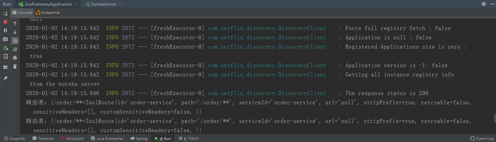
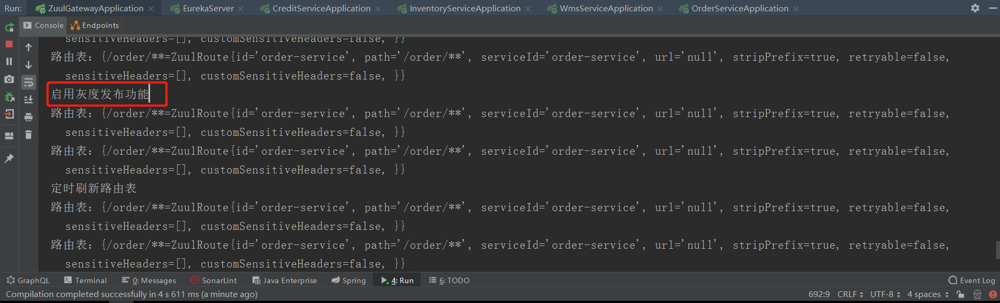

# spring-boot-zuul

> 此 demo 主要演示了 Spring Boot 如何集成整改 zuul，对 zuul 进行改造实现动态路由与灰度发布。是生产和企业中非常实用的功能。

 **动态配置与网上其他文章的思路是一样的，继承org.springframework.cloud.netflix.zuul.filters.SimpleRouteLocator重写locateRoutes方法并实现org.springframework.cloud.netflix.zuul.filters.RefreshableRouteLocator接口的refresh方法。**

## 1. 代码

### 1.1. pom.xml

```xml
<?xml version="1.0" encoding="UTF-8"?>
<project xmlns="http://maven.apache.org/POM/4.0.0"
         xmlns:xsi="http://www.w3.org/2001/XMLSchema-instance"
         xsi:schemaLocation="http://maven.apache.org/POM/4.0.0 http://maven.apache.org/xsd/maven-4.0.0.xsd">
  <parent>
    <artifactId>boot-demo</artifactId>
    <groupId>com.wulang.boot</groupId>
    <version>1.0-SNAPSHOT</version>
  </parent>
  <modelVersion>4.0.0</modelVersion>

  <artifactId>spring-boot-zuul</artifactId>
  <packaging>pom</packaging>
  <modules>
    <module>credit-api</module>
    <module>credit-service</module>
    <module>eureka-server</module>
    <module>inventory-api</module>
    <module>inventory-service</module>
    <module>order-service</module>
    <module>wms-api</module>
    <module>wms-service</module>
    <module>zuul-gateway</module>
  </modules>


</project>
```

### 1.2. WebSocketConfig.java

```java
/**
 * 实现动态路由
 *
 * SimpleRouteLocator是zuul基础路由加载类，初始化的时候自动将配置文件中配置的路由规则加载到内存中，重写locateRoutes方法将路由规则配置改为自定义的源。
 * RefreshableRouteLocator接口仅提供刷新路由表的方法，实现很简单。
 * @author wulang
 * @create 2020/1/1/9:35
 */
public class DynamicRouteLocator extends SimpleRouteLocator implements RefreshableRouteLocator {

    private JdbcTemplate jdbcTemplate;
    private ZuulProperties properties;

    public void setJdbcTemplate(JdbcTemplate jdbcTemplate) {
        this.jdbcTemplate = jdbcTemplate;
    }

    public DynamicRouteLocator(String servletPath, ZuulProperties properties) {
        super(servletPath, properties);
        this.properties = properties;
    }

    @Override
    public void refresh() {
        doRefresh();
    }

    @Override
    protected Map<String, ZuulProperties.ZuulRoute> locateRoutes() {
        LinkedHashMap<String, ZuulProperties.ZuulRoute> routesMap = new LinkedHashMap<>();
        // 加载application.yml中的路由表
        routesMap.putAll(super.locateRoutes());
        // 加载db中的路由表
        routesMap.putAll(locateRoutesFromDB());

        // 统一处理一下路由path的格式
        LinkedHashMap<String, ZuulProperties.ZuulRoute> values = new LinkedHashMap<>();
        for (Map.Entry<String, ZuulProperties.ZuulRoute> entry : routesMap.entrySet()) {
            String path = entry.getKey();
            if (!path.startsWith("/")) {
                path = "/" + path;
            }
            if (StringUtils.hasText(this.properties.getPrefix())) {
                path = this.properties.getPrefix() + path;
                if (!path.startsWith("/")) {
                    path = "/" + path;
                }
            }
            values.put(path, entry.getValue());
        }

        System.out.println("路由表：" + values);

        return values;
    }

    private Map<String, ZuulProperties.ZuulRoute> locateRoutesFromDB() {
        Map<String, ZuulProperties.ZuulRoute> routes = new LinkedHashMap<>();

        List<GatewayApiRoute> results = jdbcTemplate.query(
                "select * from gateway_api_route where enabled = true ",
                new BeanPropertyRowMapper<>(GatewayApiRoute.class));

        for (GatewayApiRoute result : results) {
            if (StringUtils.isEmpty(result.getPath()) ) {
                continue;
            }
            if (StringUtils.isEmpty(result.getServiceId()) && StringUtils.isEmpty(result.getUrl())) {
                continue;
            }
            ZuulProperties.ZuulRoute zuulRoute = new ZuulProperties.ZuulRoute();
            try {
                BeanUtils.copyProperties(result, zuulRoute);
            } catch (Exception e) {
                e.printStackTrace();
            }
            routes.put(zuulRoute.getPath(), zuulRoute);
        }

        return routes;
    }

}
```

### 1.3. 网关相关实体

> 此部分实体 参见包路径 [com.wulang.demo.zuul.gateway.model](https://github.com/sanliangitch/spring-boot-demo/tree/master/spring-boot-zuul/zuul-gateway/src/main/java/com/wulang/demo/zuul/gateway/model)

### 1.4. ServerTask.java

```java
/**
 * @author wulang
 * @create 2020/1/1/9:49
 */
@Component
@Configuration
public class GrayReleaseConfigManager {

    private Map<String, GrayReleaseConfig> grayReleaseConfigs =
            new ConcurrentHashMap<String, GrayReleaseConfig>();

    @Autowired
    private JdbcTemplate jdbcTemplate;

    @Scheduled(fixedRate = 1000)
    private void refreshRoute() {
        List<GrayReleaseConfig> results = jdbcTemplate.query(
                "select * from gray_release_config",
                new BeanPropertyRowMapper<>(GrayReleaseConfig.class));

        for(GrayReleaseConfig grayReleaseConfig : results) {
            grayReleaseConfigs.put(grayReleaseConfig.getPath(), grayReleaseConfig);
        }
    }

    public Map<String, GrayReleaseConfig> getGrayReleaseConfigs() {
        return grayReleaseConfigs;
    }

}
```
```java
/**
 * @author wulang
 * @create 2020/1/1/9:38
 */
@Component
@Configuration
@EnableScheduling
public class RefreshRouteTask {

    @Autowired
    private ApplicationEventPublisher publisher;
    @Autowired
    private RouteLocator routeLocator;

    @Scheduled(fixedRate = 5000)
    private void refreshRoute() {
        System.out.println("定时刷新路由表");
        RoutesRefreshedEvent routesRefreshedEvent = new RoutesRefreshedEvent(routeLocator);
        publisher.publishEvent(routesRefreshedEvent);
    }
}
```

## 2. 运行方式

1. 启动 `EurekaServer.java` 、其他项目、`ZuulGatewayApplication.java`
2. 访问 http://localhost:9000/order/order/create?productId=1&userId=1&count=2&totalPrice=50&gray=true

## 3. 运行效果





## 4. 参考
[SpringCloud微服务Zuul网关动态路由](https://blog.csdn.net/qq_20112609/article/details/84539747)
