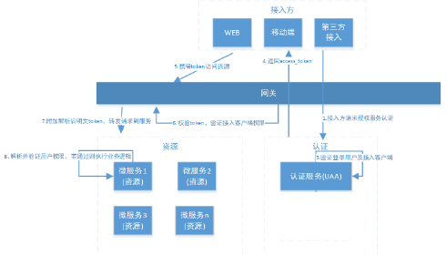

**Spring Cloud Security OAuth2**
---

* 流程描述：
1. 用户通过接入方（应用）登录，接入方采取OAuth2.0方式在统一认证服务(UAA)中认证。
2. 认证服务(UAA)调用验证该用户的身份是否合法，并获取用户权限信息。
3. 认证服务(UAA)获取接入方权限信息，并验证接入方是否合法。
4. 若登录用户以及接入方都合法，认证服务生成jwt令牌返回给接入方，其中jwt中包含了用户权限及接入方权限。
5. 后续，接入方携带jwt令牌对API网关内的微服务资源进行访问。
6. API网关对令牌解析、并验证接入方的权限是否能够访问本次请求的微服务。
7. 如果接入方的权限没问题，API网关将原请求header中附加解析后的明文Token，并将请求转发至微服务。
8. 微服务收到请求，明文token中包含登录用户的身份和权限信息。因此后续微服务自己可以干两件事：1，用户授权拦截（看当前用户是否有权访问该资源）2，将用户信息存储进当前线程上下文（有利于后续业务逻辑随时获取当前用户信息）

* 流程所涉及到UAA服务、API网关这三个组件职责如下：\
1）统一认证服务(UAA) \
它承载了OAuth2.0接入方认证、登入用户的认证、授权以及生成令牌的职责，完成实际的用户认证、授权功能。 \
2）API网关  \
作为系统的唯一入口，API网关为接入方提供定制的API集合，它可能还具有其它职责，如身份验证、监控、负载均衡、缓存等。API网关方式的核心要点是，所有的接入方和消费端都通过统一的网关接入微服务，在网关层处理所有的非业务功能。
